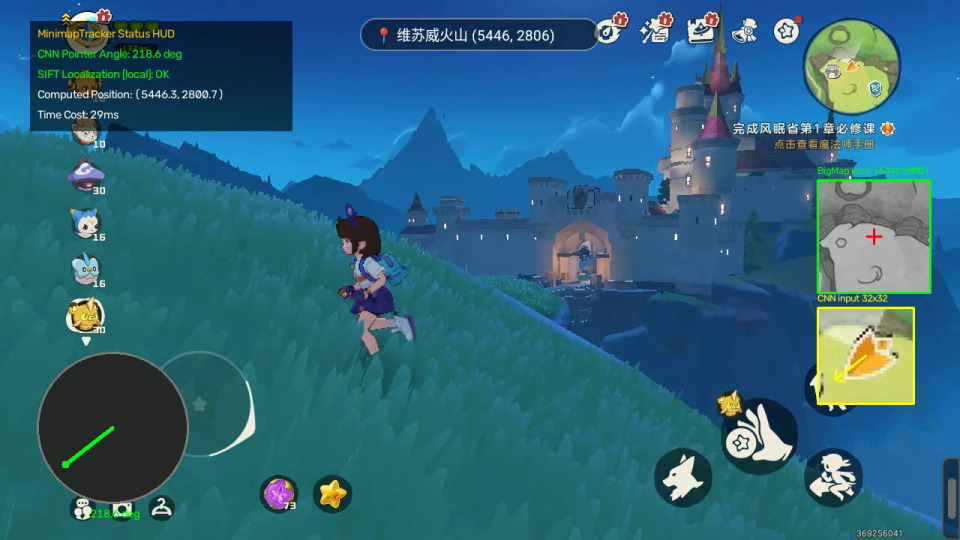
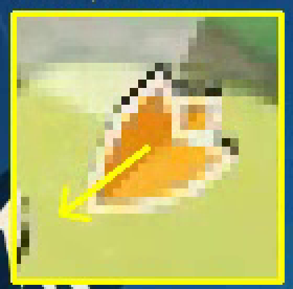

# MinimapTracker

轻量、通用的实时小地图玩家定位（Localization）与指针朝向检测（Pointer Orientation Detection）C++ 动态链接库。

本库已剔除特定游戏的寻路与动作决策，只提供视觉特征定位与状态跟踪，适用于各种基于 2D 小地图的位置跟踪场景。

---

## 🎬 效果演示

下面是在一段 1280×720、298 帧的真实游戏录像上跑出来的结果。

### 渲染结果（含定位与指针角度）

<video src="docs/media/rendered_result.mp4" poster="docs/hud_preview.png" controls muted playsinline width="100%"></video>

> 若上方播放器未渲染，直接打开 [`docs/media/rendered_result.mp4`](docs/media/rendered_result.mp4)。



HUD 各部分含义：

| 位置 | 内容 |
|---|---|
| 左上 | 状态面板：CNN 指针角度、定位模式（global / local）、解算出的全局坐标、单帧耗时 |
| 右侧 | 大地图局部贴图，红色十字为解算出的玩家位置，随移动同步滚动 |
| 右下 | **CNN 的真实输入**（32×32 patch 放大），黄色箭头是网络解算出的方向 |
| 左下 | 雷达盘，标准极坐标（0°=东，90°=北） |

右下角这块是刻意加的：把网络实际看到的像素和它输出的角度画在一起，就能直接核对角度对不对，而不是靠"看起来没问题"。



### 输入原始录像（未处理）

<video src="docs/media/input_capture.mp4" controls muted playsinline width="100%"></video>

> 直接打开：[`docs/media/input_capture.mp4`](docs/media/input_capture.mp4)

两个视频都是 H.264 / yuv420p，可直接在浏览器播放。仓库 `.gitignore` 默认忽略 `*.mp4`，这两个通过 `!docs/media/*.mp4` 例外保留。

### 实测数据

```
定位          292/298 帧成功 (98.0%)，0 次丢失后重配准
首次锁定      第 6 帧，全局 SIFT 配准，(5440.8, 2824.8)，耗时 29ms
              第 1 帧的误匹配被质量门禁正确拒绝
单帧耗时      局部 18-25ms，全局配准 29-93ms
指针角度      与另一套独立算法交叉验证，中位差 8.1°，93.1% 在 20° 以内
```

---

## 🎨 系统架构


图中所有参数与数字都取自已验证的实现，不含设计意图。改完用下面三步重新出图：

```bash
# 1. 生成 excalidraw 场景
python3 images/generate_architecture.py images/minimap_tracker_architecture.excalidraw
# 2. 渲染为手绘风 SVG
node ~/.agents/skills/video-notes-generator/scripts/render_excalidraw.js \
     images/minimap_tracker_architecture.excalidraw \
     images/minimap_tracker_architecture.svg
# 3. 内嵌中文字体子集（必做）
python3 images/embed_cjk_font.py images/minimap_tracker_architecture.svg
```

第 3 步不能省：excalidraw 内嵌的 Virgil 是拉丁手绘字体，**没有 CJK 字形**。不处理的话中文会回退到查看端的系统字体 —— 没装中文字体的环境里直接变豆腐块。该脚本把图中实际用到的汉字（当前 135 个）从 Noto Sans CJK 子集化成 woff2（23 KB）内联进 SVG，成品零外部引用，到哪都一样。图形部分仍由 roughjs 生成，保持手绘感。

两个核心模块：

1. **神经网络指针检测器**：NCNN 加载 CNN 做单次前向角度回归，输出 `[sin, cos]` 后 `atan2` 解角。相比传统的颜色过滤 + BFS 连通域方法，在光照渐变和指针对齐偏差下更稳。
2. **混合地图定位引擎**：全自动状态机（`track_minimap()`，`src/map_sift_tracker.cpp`）。调用方每帧丢进一整帧像素即可，不需要自己判断该用哪种模式：未定位时全局 SIFT 配准，锁定后切 SuperPoint 局部追踪（搜索窗口 = 上一帧 ±150 px），局部持续失败 ≥ 2000ms 则回退全局。

全局搜索有 2 秒节流（`kGlobalSearchFallbackDelayMs`），避免丢失时 CPU 打满。

---

## ⚙️ 编译构建

### 依赖
* CMake >= 3.10
* **OpenCV >= 4.0（C++ 开发包，不是 Python 的 `cv2`）** —— 用于 SIFT 与矩阵变换
* NCNN —— 用于 SuperPoint 与指针 CNN 推理

### Android（arm64-v8a）

已验证可用：

```bash
NDK=/path/to/android-sdk/ndk/26.1.10909125
cmake -S . -B build-android \
      -DCMAKE_TOOLCHAIN_FILE=$NDK/build/cmake/android.toolchain.cmake \
      -DANDROID_ABI=arm64-v8a -DANDROID_PLATFORM=android-29 \
      -DCMAKE_BUILD_TYPE=Release
cmake --build build-android -j8
```

### Linux PC

```bash
cmake -DCMAKE_C_COMPILER=/usr/bin/gcc -DCMAKE_CXX_COMPILER=/usr/bin/g++ \
      -DCMAKE_CXX_STANDARD=17 -S . -B build
cmake --build build
```

两个注意点：

1. **必须先装 OpenCV C++ 开发包**（`libopencv-dev` 或等价物）。conda 里的 `cv2` 是 Python 绑定，不带 C++ 头文件和 CMake config，`find_package(OpenCV REQUIRED)` 找不到它。
2. **显式指定编译器**。如果 `PATH` 里的 `cc` 被别的东西占用（不是真编译器），CMake 探测阶段会报 `error: unknown option '-o'`。

---

## 🔌 核心 API

头文件 `src/navigation_engine.h`。

### 像素格式契约（重要）

所有 `const int32_t* frame_pixels` 都是 **ARGB packed int32**：

```
每个 int = (A<<24) | (R<<16) | (G<<8) | B
```

与 Android `Bitmap.getPixels(int[])` 一致。**小端机器上它的内存字节序是 `B,G,R,A`**，所以库内部按 BGRA 解释。

若你手上是 `AndroidBitmap_lockPixels` 拿到的 RGBA_8888 原始缓冲区（内存序真是 `R,G,B,A`），请走 `MapSiftTracker` 的 JNI 接口，不要用这里的 C API。

### 指针检测

```cpp
NAV_EXPORT void* pointer_detector_create(const char* model_dir);
NAV_EXPORT bool  pointer_detector_detect(void* handle, const int32_t* frame_pixels, int w, int h,
                                         bool* has_match, float* angle_deg, float* confidence);
NAV_EXPORT void  pointer_detector_release(void* handle);
```

> ⚠️ 该网络是纯角度回归，**没有拒识头**，输出向量已 L2 归一化（实测 `|[sin,cos]|` 恒为 1.0）。
> 所以 `has_match` 只表示"推理成功"，`confidence` 是固定占位常量 1.0，**不是概率，不要拿它做阈值**。

### 地图定位

```cpp
NAV_EXPORT void* player_tracker_create(const char* map_path, const char* cache_path,
                                       const char* model_dir,
                                       int minimap_left, int minimap_top,
                                       int minimap_width, int minimap_height,
                                       int base_search_radius, int max_lost_frames,
                                       double clahe_limit, float match_ratio,
                                       int min_match_count, double ransac_threshold);
NAV_EXPORT bool  player_tracker_locate(void* handle, const int32_t* frame_pixels, int w, int h,
                                       float* out_x, float* out_y, float* confidence, int* cost_ms);
NAV_EXPORT void  player_tracker_release(void* handle);
```

`base_search_radius` 是**半径**，不是窗口边长。`confidence` 目前只是 `found ? 1.0 : 0.0` 的二值量。

### 简化聚合接口（推荐）

Python/FFI 调用方不需要分别管理两个 native handle，也不需要把 OpenCV 图像手动打包成
ARGB。`navigation_engine_create()` 使用生产默认参数，模型根目录下只需保持
`pointer_model/` 与 `superpoint_model/` 两个子目录：

```c
NAV_EXPORT void* navigation_engine_create(const char* model_root_dir,
                                          const char* map_path,
                                          const char* cache_path);
NAV_EXPORT int navigation_engine_process_bgr(void* handle,
                                             const uint8_t* frame_bgr,
                                             int width, int height, int stride_bytes,
                                             NavigationEngineResult* out_result);
NAV_EXPORT const char* navigation_engine_last_error(void* handle);
NAV_EXPORT void navigation_engine_release(void* handle);
```

`process_bgr()` 返回 1 表示调用成功；是否定位、是否得到角度分别读取结果中的
`located` 和 `pointer_detected`。

---

## 🧪 测试

### `test/test_video.py` —— Python ctypes 集成测试

Python 不保留独立算法实现，统一加载编译出的 `.so`，在无 JVM 依赖的条件下直接调用生产 C API。运行前需要先完成上面的 Linux PC 构建。

业务代码推荐使用 `python/minimap_tracker.py` 的薄封装，它只负责 `ctypes` 和
NumPy 参数转换，所有算法仍在 `.so` 内：

```python
from minimap_tracker import NavigationEngine

with NavigationEngine("models", "/path/to/big_map.png", "build/sift_cache.bin") as engine:
    result = engine.process(frame_bgr)
    print(result.located, result.x, result.y, result.angle_deg)
```

从源码目录直接运行自己的脚本时，将薄封装目录加入模块搜索路径：

```bash
PYTHONPATH=python python3 your_script.py
```

```bash
python3 test/test_video.py [视频路径]
```

输出写到 `test_output_ctypes.mp4`。

---

## ⚠️ 踩过的坑

三个都是同一类错误：**把非连续或非预期布局的缓冲区直接交给了推理框架**。改这类代码时，任何进 `from_pixels` / `ncnn.Mat` 的缓冲区都要先确认 stride 和排布。

| # | 问题 | 后果 |
|---|---|---|
| 1 | 整帧的 ROI 视图喂给不带 stride 的 `from_pixels` | 角度误差中位数 **141°** |
| 2 | ARGB packed int 当成 RGBA 解释（R/B 对调） | 角度误差中位数 **136°** |
| 3 | numpy 转置视图未转连续就交给 `ncnn.Mat` | 网络收到交错 BGR 当 planar，角度完全错 |

**坑 1**：`frame(mm_rect)(patch_rect)` 得到的是**视图**，行间距仍是整帧的 3840 字节，而 `from_pixels(data, type, w, h)` 按 `w*3 = 96` 字节紧凑读取 —— 只有第 0 行是对的。用带 stride 的重载，传 `patch.step`。

**坑 3**：`patch.transpose(2,0,1).astype(np.float32)` 看着像做了拷贝，但 `astype` 默认 `order='K'` 会**保留输入的内存布局**，转出来的数组 strides 是 `(4, 384, 12)`，内存里仍是 HWC 交错。必须显式 `np.ascontiguousarray(...)`。

---

## 📌 已知限制

* **必须调用 `player_tracker_set_precise_tracking(handle, true)`，否则定位成功率腰斩。**

  这个开关默认关闭，但基本上没有理由关。实测（`test/test_video.py`，298 帧）：

  | 精确追踪 | 定位成功率 |
  |---|---|
  | 关（默认） | 184/298 = **61.7%** |
  | 开 | 295/298 = **99.0%** |

  原因在 SuperPoint 局部匹配的地图特征来源。关闭时优先从**全图特征缓存**取子集，
  而该缓存是分块降采样提取的，全图仅 6949 个特征（SIFT 是 139709），落到 300×300
  搜索窗口内平均只有 ~17 个，实测 good match 中位数 7、内点中位数 4，而门禁要求
  20 good / 15 inliers —— 这条分支实测 **0/111 成功**。

  失败后 `retry_full_resolution_enabled_`（默认开）会让下一帧改用**局部裁剪现场提取**，
  那条分支实测 **110/110 成功**。但成功会把 `local_sp_failure_streak_` 清零
  （`map_sift_tracker.cpp:798`），于是下一帧又退回缓存分支 —— **每隔一帧振荡一次**，
  成功率正好被砍半。

  打开精确追踪后 `can_use_full_map_cache` 恒为 false，永远走现场提取，振荡消失。
  Android app 侧（`ScreenRecorderService.java:148` 默认 `true`，第 508 行传入）一直是
  打开的，这就是 app 的局部匹配一直正常、而抽出来的库不正常的全部原因 ——
  算法一字未改，缺的是这个开关。
* CNN 没有拒识能力，上层若需要"当前帧是否有指针"的判断，得自己补。
* 与原 Rust 算法交叉验证时，约 6.6% 的帧差异较大（最大 173.8°），尚未逐帧归因。
* 演示录像的游戏画面顶部本身就显示玩家坐标，可作 ground truth 逐帧比对精度 —— 尚未做。
