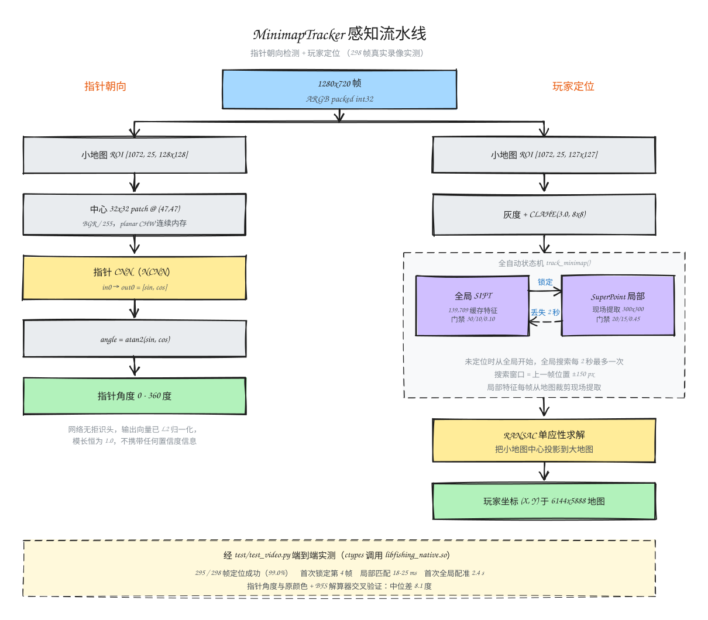

# MinimapTracker

用于从 1280×720 游戏画面中计算玩家地图坐标和小地图指针角度的 C++ 动态库。

## 架构



## 编译

依赖 CMake、OpenCV C++ 和 NCNN。

Linux：

```bash
cmake -S . -B build \
  -DCMAKE_C_COMPILER=/usr/bin/gcc \
  -DCMAKE_CXX_COMPILER=/usr/bin/g++
cmake --build build -j8
```

产物：`build/libfishing_native.so`

Android arm64-v8a：

```bash
NDK=/path/to/android-sdk/ndk/26.1.10909125

cmake -S . -B build-android \
  -DCMAKE_TOOLCHAIN_FILE=$NDK/build/cmake/android.toolchain.cmake \
  -DANDROID_ABI=arm64-v8a \
  -DANDROID_PLATFORM=android-29 \
  -DOpenCV_DIR=/path/to/OpenCV-android-sdk/sdk/native/jni \
  -DCMAKE_BUILD_TYPE=Release
cmake --build build-android -j8
```

产物：`build-android/libfishing_native.so`

NCNN 路径由 `CMakeLists.txt` 中的 `NCNN_ROOT` 配置。

## Python 使用

Python 只负责加载 `.so`，所有算法均在 Native 库中执行。

```bash
PYTHONPATH=python python3 your_script.py
```

```python
import cv2
from minimap_tracker import NavigationEngine

# OpenCV 读取的图片或 VideoCapture 帧默认就是 uint8 BGR。
frame_bgr = cv2.imread("/path/to/frame.png")

with NavigationEngine(
    model_root="models",
    map_path="/path/to/big_map.png",
    cache_path="build/sift_cache.bin",
) as engine:
    result = engine.process(frame_bgr)  # uint8 BGR ndarray

    if result.located:
        print("position:", result.x, result.y)

    if result.pointer_detected:
        print("angle:", result.angle_deg)
```

输入要求：

- 类型：`numpy.ndarray`
- 数据类型：`uint8`
- 形状：`(height, width, 3)`
- 通道顺序：BGR
- 默认画面尺寸：1280×720

包装层会自动把非连续的 NumPy 视图转换为连续内存。

输出字段：

| 字段 | 含义 |
|---|---|
| `located` | 本帧是否定位成功 |
| `x`, `y` | 玩家在大地图上的像素坐标 |
| `locate_cost_ms` | 定位耗时 |
| `pointer_detected` | 指针模型是否推理成功 |
| `angle_deg` | 指针角度，范围 `[0, 360)` |

## Android 使用

1. 将 `libfishing_native.so` 放入：

   ```text
   app/src/main/jniLibs/arm64-v8a/
   ```

2. 加载动态库：

   ```java
   System.loadLibrary("fishing_native");
   ```

3. 在 JNI 层包含 `src/navigation_engine.h`，调用：

   ```c
   navigation_engine_create(...)
   navigation_engine_process_bgr(...)
   navigation_engine_release(...)
   ```

4. 将 Android `RGBA_8888 Bitmap` 转为 BGR 后传入：

   ```cpp
   #include <jni.h>
   #include <android/bitmap.h>
   #include <opencv2/imgproc.hpp>
   #include "navigation_engine.h"

   NavigationEngineResult process_bitmap(
           JNIEnv* env,
           jobject bitmap,
           void* engine) {
       AndroidBitmapInfo info{};
       NavigationEngineResult result{};
       if (AndroidBitmap_getInfo(env, bitmap, &info) != ANDROID_BITMAP_RESULT_SUCCESS ||
           info.format != ANDROID_BITMAP_FORMAT_RGBA_8888) {
           return result;
       }

       void* pixels = nullptr;
       if (AndroidBitmap_lockPixels(env, bitmap, &pixels) != ANDROID_BITMAP_RESULT_SUCCESS ||
           pixels == nullptr) {
           return result;
       }

       cv::Mat rgba(
               static_cast<int>(info.height),
               static_cast<int>(info.width),
               CV_8UC4,
               pixels,
               info.stride);
       cv::Mat bgr;
       cv::cvtColor(rgba, bgr, cv::COLOR_RGBA2BGR);

       int ok = navigation_engine_process_bgr(
               engine,
               bgr.data,
               bgr.cols,
               bgr.rows,
               static_cast<int>(bgr.step),
               &result);

       AndroidBitmap_unlockPixels(env, bitmap);

       if (!ok) {
           // navigation_engine_last_error(engine) 可获取错误原因。
       }
       return result;
   }
   ```

输出的 `NavigationEngineResult` 可在 JNI 层转换为 Java/Kotlin 对象：

| 字段 | 含义 |
|---|---|
| `located` | 非 0 表示定位成功 |
| `x`, `y` | 大地图像素坐标 |
| `locate_cost_ms` | 定位耗时 |
| `pointer_detected` | 非 0 表示指针推理成功 |
| `angle_deg` | 指针角度 |

默认小地图区域为 `(1072, 25, 127, 127)`。
